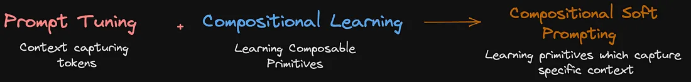

This article assumes a basic understanding of these concepts : [Embeddings](https://towardsdatascience.com/neural-network-embeddings-explained-4d028e6f0526), [Transformers)](https://towardsdatascience.com/illustrated-guide-to-transformers-step-by-step-explanation-f74876522bc0), [CLIP](https://www.youtube.com/watch?v=dh8Rxhf7cLU) (optional)

**Compositional learning** in Visual Language Models (VLMs) is a field of Deep Learning which aims to teach large models a diverse set of modular primitives, such as, objects and their attributes which can then be recomposed to construct more complex concepts, much like stacking lego bricks.

**Zero-Shot inference** refers to the ability of models to perform a particular task without ever having seen a similar example during training, or performing a novel task without any examples of how to perform that task in its context. For example, asking a model which has been trained on hundreds of examples of ‘movie review sentiment’ classification to classify emails as ‘spam’ or ‘not spam.’ In a way, this is a true test of a models ability to generalize concepts it has learnt, to perform on novel inputs or tasks.

**Zero-Shot Compositional Learning (CZSL)** is the ability of VLMs to identify primitive combinations that it has never seen before during training. Confused ?

  
  

    Compositional Zero-Shot Learning
  

We want to gauge the ability of a VLM to identify certain **\<attribute\>\<object\>** pairs found in an image, for example old socks, dirty socks or clean socks. Following the above image, pairs marked ‘?’ are combinations that the model will not be trained on, i.e during training the model has seen : Wet Dog & Wet Cat, Old Dog & Old Car, Dry Cat & Dry Car. While our VLM has seen some examples of wet **\<object\>**, and also **\<attribute\>** car, has the model understood “wet” and “car” sufficiently to identify the combination “wet car,” a combination the model has not trained on? Similarly, can it identify an old cat or a dry dog ? In a more generic sense, given that the model has some understanding of a particular attribute and a particular object, could it identify the unseen attribute-object pair comprising the two ?

While this task seems easy, an important consideration is that an attribute’s qualities are subject dependent. While a wet dog and wet cat are quite similar (both seem to be irritated and have clumped hair) a wet car is just shiny and reflective.

Why is compositionality important ? As we move towards general intelligence, the ability of a model to understand and apply abstract concepts becomes significantly important. Just as a disproportionate amount of our understanding of the world is instilled through co-relation and experience in a multi-modal setting, models cannot be taught everything. There is also a marked improvement in the ability of models to be fine-tuned on a down-stream task when they are able to understand more general tasks and concepts. This is similar to how we are able to draw parallels between different subjects we study.

---

## Early Visual Language Models

The earliest approach to the above task was a classification model. Given an image, use any CNN (and later ViT) architecture to generate an image embedding. This image embedding is then fed into separate classifiers (Feed Forward Networks) which predict the logits of all objects and attributes in the dataset which are then softmaxed to get their corresponding probabilities. i.e it is formulated as a classification problem with the possible output classes being the set of objects and attributes in the dataset.

  
  

    CNN + Classifier (FFN) based VLM
  

As multi-modal learning was explored it became more apparent that as humans, we do not have a separate knowledge pool of sound, vision and language. We understand some kind of shared space between the 3 modalities. Using an independent feature extractors for the input image and objects + attribute we obtain an embedding for each. We then learn some kind of transform — a projection from some k-dimensional space to another d-dimensional space where d is the dimension of every point in the new latent space — for the concatenated object and attribute embedding to the latent space shared with image embeddings. The transform and/or model weights are tuned to minimize the distance ([cosine](https://en.wikipedia.org/wiki/Cosine_similarity), [manhattan](https://simple.wikipedia.org/wiki/Manhattan_distance) or [euclidean](https://en.wikipedia.org/wiki/Euclidean_distance)) between the text and image embeddings.

  
  

    Transform based VLMs
  

As transformers became increasingly popular, and the [**Vision transformer (ViT)**](https://arxiv.org/abs/2010.11929) was developed, it became possible to capture sentence-level embeddings more comprehensively. Learning a shared latent space of images and text was the central idea behind **CLIP (Contrastive Language Image Pre-training)**. CLIP contains separate encoders for both modalities. CLIP is trained with the objective of maximizing distance between unrelated text and images while minimizing the distance between related text and images in the latent space. CLIP was trained on a massive **400M+** image-text pairs. This created a powerful shared embedding which could very easily be used for image classification, image retrieval and variety of other tasks.

  
  

    CLIP Architecture
  

To perform classification using CLIP :

1. Create embeddings for all classes in your dataset using the independent text-encoder — **_(T1,T2,T3…TN)_**. Use the sentence “A photo of a <object>” for embeddings.
2. Create an image embedding using the independent image-encoder : **_X_**
3. Find the minimum distance between every text-embedding and the image embedding : **_Argmin(Dist(Ti.X))_** for 1 ≤ i ≤ N
4. The original text corresponding to the text-embedding which was closest to the image-embedding is the required class.
5. The distance value can be used to evaluate model confidence.

  
  

    <a href="https://arxiv.org/pdf/2204.03574.pdf">CLIP</a>
  

While the first two architectures can be trained for compositional learning (as explained above), they suffer from two problems :

1. A latent space between images and text needs to be learned from scratch. This requires a large corpus of annotated data and compute.
2. An important metric for CZSL is the ability of the trained model to generalize to text lengths longer than it was trained on. For example instead of being able to identify “A photo of a wet dog”, we want to test the ability of the model to identify “A photo of a muddy wet dog”, which is not possible to do without architectural changes in the first two models.

CLIP can easily be adapted to compositional learning and gives us the following advantages :

1. It is trained on a gigantic data corpus, therefore an entire latent space need not be learned for compositional learning from scratch.
   CLIP works on sentence level embeddings unlike transform based VLMs which work on word/token-level embeddings. This gives us the ability to inference it on arbitrary length prompts.
2. It uses powerful, independent transformers for both image and text encoding. This allows us to modify either transformer’s weights independently. Also, the text encoder allows us to adapt learning techniques such as [**prompt-engineering**](https://medium.com/@fareedkhandev/prompt-engineering-complete-guide-2968776f0431) and [**soft-prompting**](https://ai.googleblog.com/2022/02/guiding-frozen-language-models-with.html) typically used for Large Language Models to VLMs.

---

## Exploring Text-Encoder Modifications

  
  

    <a href="https://ai.googleblog.com/2022/02/guiding-frozen-language-models-with.html">LLM Prompting / Tuning Techniques</a>
  

#### Fine Tuning / Model Tuning

Generally, the compute and data required to train a transformer based language model (**LM**) from scratch is unaffordable for the average company let alone an individual. Instead, we often try to fine-tune pre-trained LMs to a downstream or more specific task. Fine-tuning involves unfreezing a subset of or the entire set of model weights and replicating its training process on a custom dataset. It is generally done when we want to change some model behavior rather than increase its knowledge base. For example, we may want the model to return answers to all questions as a haiku rather than blurting out boring conversational replies. Since LMs are comprised of billions of parameters, this process is extremely time consuming even with sophisticated GPUs and parallelization. More-over fine-tuned LMs are subject to catastrophic forgetting during fine-tuning. ‘Catastrophic forgetting’ refers to a phenomenon where-in the model adapts well to the new dataset / task, however its performance degrades on other general tasks. That is, the model begins to forget everything else it had learnt as it begins to focus specifically on the task you trained. Recently parameter efficient techniques such as [**LoRA**](https://medium.com/serpdotai/lora-low-rank-adaptation-of-large-language-models-82869419b7b8) and [**Quantized LoRA (QLoRA)**](https://medium.com/@gitlostmurali/understanding-lora-and-qlora-the-powerhouses-of-efficient-finetuning-in-large-language-models-7ac1adf6c0cf) have been introduced to reduce the compute required to fine-tune models and also tackle catestrophic forgetting.

#### Prompt Engineering

An interesting phenomenon observed in LLMs is that asking the model to perform a particular task in different ways leads to better or worse performance though the task at hand is the same. This is done entirely by changing inputs to the model at inference time, without changing any weights of the model. The unfortunate downside to prompt-engineering is that it often takes several hours to carefully design an optimal prompt. The most common ways of prompting the model include :

1. Giving the model a personality : “You are a financial advisor…”
2. Giving in-context examples : Few-Shot and Many Shot

**Few-shot** and **Many shot** are not strictly defined, but the basic understanding is that by providing the model examples of the task at hand within the context before asking it to perform the task on an input significantly increases model performance. Few and Many shot are understood in terms of the number of examples provided. It is also generally observed that increasing the number of examples within the context increases model performance before it eventually becomes constant with increased examples. One major limitation to this form of prompt-engineering is the cap (maximum token limit) on input length to the model. Often, this limits the ability to provide the model all crucial examples before inferencing on a task. Though prompt-engineering is not directly applied in the case of CSP (multi-modal in-context examples is a different ball-game altogether) the idea of providing examples to the model is fundamental.

#### Soft Prompting / Prompt Tuning

Fine-Tuning large models is expensive and crafting the perfect prompt is draining. What if we could train the model to learn the perfect prompt while only adding a proportionally insignificant number of new weights to the model ?

  
  

    Soft-Prompting Overview
  

Soft prompting is a technique which allows the model to learn initial embeddings to its encoder directly without having to really understand what tokens or words those embeddings correspond to. In other words, we learn prompts which are not human readable and are not “fixed” like “hard” prompts that we are able to write as humans. Not following ?

The high-level working of the transformer is explained in the diagram above. A tokenizer converts words from the prompt “A photo of me” (Ignore T5 for now) into intermediate representations called tokens **(T1-T4)**. Most models today use [**Byte-Pair Encoding (BPE)**](https://towardsdatascience.com/byte-pair-encoding-subword-based-tokenization-algorithm-77828a70bee0) to learn heuristic tokenization and assign a number to each unique sub-word token. The tokens **(T1-T4)** are then passed through an embedding layer to get initial embedding representations of the same words **(E1-E4)**. The embeddings are then concatenated with their sinusoidal positional embeddings before being pushed through **Multi-Headed Self Attention (MSA)**, normalization and other operations before resulting in a sentence level embedding as we know it.

One limiting factor here is the ability to only pass words in the tokenizers vocabulary to the models embedding layer. Considering the vastness of the latent space of embeddings, we are able to access a small portion of the models understanding to guide its inference. Another point in the latent space could be more suitable for guiding the model to reach the output we desire but is not accessible due to vocabulary limitations. In a sense, our goal is to understand the embedding latent space, and pick certain regions of its understanding to guide model inference for our use.

Refer now to **T5**, another token which is directly introduced into the model as an embedding **E5**. We do not know if **T5** corresponds to a token the tokenizer understands, or something human readable but since tokenization is essentially pre-processing, the model never sees the tokens. The model simply treats it as another word in its input in the form of its embedding. The new embedding of some arbitrary token **T5**, is **E5** (Which we directly fed into the first encoding layer) from which **(E+P)5** is generated after positional embedding.

To clarify further, the rest of the model functioning remains the same. From **(E+P)1** through **(E+P)5**, **Query**, **Key** and **Value** vectors are generated for using feed forward networks in each attention head same as before. The image below shows this process for the original tokens and the newly inserted token belonging to the soft prompt.

Now these **Q**, **K**, **V** vectors are used to perform attention with matrix multiplication, i.e the Queries \* Keys are multiplied with Values to get the new attention-ed vectors for **(E+P)1** to **(E+P)5**. The diagram below shows how all that changes in terms of calculation is the dimensionality of the matrix multiplication performed.

To re-iterate, each soft prompt is just another word or set of words for the model.
This new embedding **E5** is entirely tunable and serves as the only additional learnable weights added to the model while the original model weights remain frozen. Extending this idea, a soft prompt could consist of several of these tunable tokens.
The main idea behind soft-prompting relates to many-shot prompt-engineering. These new tunable tokens together capture the same meaning that in-context examples would, but at a significantly larger scale. Each one of these tokens could potentially store thousands of examples worth of context for the model to attend to during inference. We have found a way to capture very large contexts at the expense of training a smaller number of weights.

#### Early Soft Prompting

The original approaches to soft-prompting as a means of fine-tuning for a particular task involved learning a single soft-prompt **F** for a task. The soft-prompt comprising of **P** new embeddings would capture important information pertaining to the entire training dataset. This prompt is an extensive but general representation of the task.

Another approach involves learning multiple different prompts **F1,F2,F3…** Each prompt corresponds to information about a different task. This allows us to use the same model for different tasks by simply adding the soft-prompt corresponding to a particular task on new inputs.

---

## Combining Compositional Learning and Soft Prompting

**Compositional Soft Prompting (CSP)** is a way of learning soft-prompts for each attribute and object in the dataset. Think of it as a way to learn an enhanced vocabulary of primitives, where each primitive doesn’t just capture what the word means, but also information pertaining to thousands of examples of its usage. We are learning primitives that capture context specific to themselves to guide the model during inference rather than learning generic prompts which capture overall context.

**How do we use these new primitives ?**

During training or inference, we generally convert a prompt similar to “A photo of a \<_attribute_\> \<_object_\>” into its embedding to perform classification. Assume that our prompt has a fixed length of **N** tokens. The last two tokens in this **N** token representation refer to the attribute and the object in the above prompt. Since we are trying to learn new embeddings for every attribute and object, we simply replace the **Nth** and **N-1th** token with their corresponding tunable embeddings and pass it through the model.

Consider the original set of embeddings to be **R(NxD)** where **D** is the dimensionality of each embedding. Say the attribute is a set of **P1** embeddings, and the object is a set of **P2** embeddings. The new set of embeddings is therefore **R((N-2+P1+P2)xD)** where only **P1** and **P2** embeddings are trainable.

  
  

    Prompt-Token Replacement Visualization
  

If we have a total of **|A|** attributes and **|O|** objects where each attribute is comprised of **P1** tokens and each object is comprised of **P2** tokens, the total number weights trained is **(|A| x P1 + |O| x P2)xD** where **D** is the fixed dimensionality of an embedding in the latent space. This is significantly less than the total weights in the model (in the order of billions) and therefore is much cheaper and faster to train.

#### Weight Initialization

  
  

    <a href="https://arxiv.org/pdf/2204.03574.pdf">CSP - Weight Initialization & Training</a>
  

In this particular approach **|P1| = |P2| = (1 x D)** i.e each tunable attribute and object embedding is a single embedding/token of dimension D. These embeddings are initialized to be the same as their initial embeddings from the embedding layer after tokenization. In the case that the initial embedding from the embedding layer comprises multiple tokens, i.e the initial embedding is of the form **(M x D)**, the average of all embeddings will be taken (M is generally 2) to yield an embedding of **(1 x D)**. These initial representations are stored in some arbitrary array of all attributes followed by all objects with an offset to demarcate where the object embeddings begin. Another implementation choice could be to use a hash-map instead.

#### Understanding The Training Objective

This equation represents the initial text embedding for an attribute **(a)** and object **(o)** pair. **w0 - wp** are tokens of the prefix context (“A photo of a”) while **θa**, **θo** represent tunable embeddings for ‘a’ and ‘o’.

We then pass **t(a, o)** through the VLM’s text encoder to get its final normalized sentence embedding.

Similarly, the image **x** is passed through the VLM’s image encoder to get an image embedding.

We next calculate the conditional probability of predicting **y = (a, o)** i.e the correct attribute and object given the image as an input. This can be calculated as the softmax of the cosine distances (dot product of **x** and **t(a, o)**) over all attribute object pairs. Here, tau is the temperature parameter from CLIP. The formula for softmax is as given below :

Finally we can calculate the **cross-entropy loss** over the dataset as follows :

We take the summation of negative log probabilities of predicting the right object and attribute given an image **x** for all **x, y** in the training dataset. We also add a **normalization term** and a **L2 regularization** term to prevent over-fitting. Here lambda is the the weight decay constant for regularization.
The gradients accumulated are back-propagated through the network to update just θa,θo for every combination of attribute and object, thus training a very small set of weights.

## Results

**CSP** significantly improves over CLIP across three benchmark datasets by an average accuracy of **13.7 percentage points** in the closed-world setting and **8.0 percentage points** in the open-world setting. The closed world setting limits attribute and object pairs to those actually being found in the dataset (while calculating softmax), while in the open world setting, all possible combinations are considered, weighted by their likelihood of occurrence based on cosine similarities between object pairs and attribute pairs. For example, comparing ‘muddy’ and ‘wet’ results in higher similarity than rusty and wet when comparing similar objects such as dogs and cats. Therefore, a ‘muddy cat’ is a much more likely class than a ‘rusty cat’ given that a wet dog is a class we know occurs in the dataset.

## _References_

1. [Learning to Compose Compositional Soft Prompts for Compositional Zero-Shot Learning](https://arxiv.org/pdf/2204.03574.pdf)
2. [Learning Transferable Visual Models From Natural Language Supervision](https://arxiv.org/pdf/2103.00020.pdf)
3. [Attention Is All You Need](https://arxiv.org/pdf/1706.03762.pdf)
4. [Soft Prompting](https://ai.googleblog.com/2022/02/guiding-frozen-language-models-with.html)
5. [Transformers](https://towardsdatascience.com/illustrated-guide-to-transformers-step-by-step-explanation-f74876522bc0)
6. [CLIP](https://www.youtube.com/watch?v=dh8Rxhf7cLU&ab_channel=AICoffeeBreakwithLetitia)
7. [Open World CZSL (Compositional Zero Shot Learning)](https://www.youtube.com/watch?v=BoDmWXFqQ98&t=2271s&ab_channel=COMPUTERVISIONTALKS)
